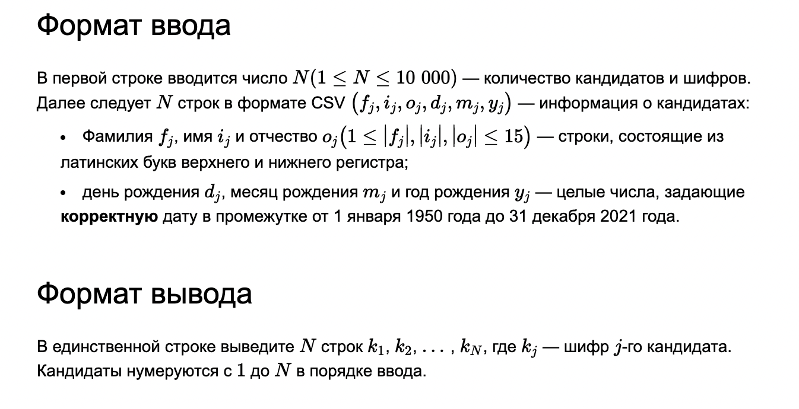
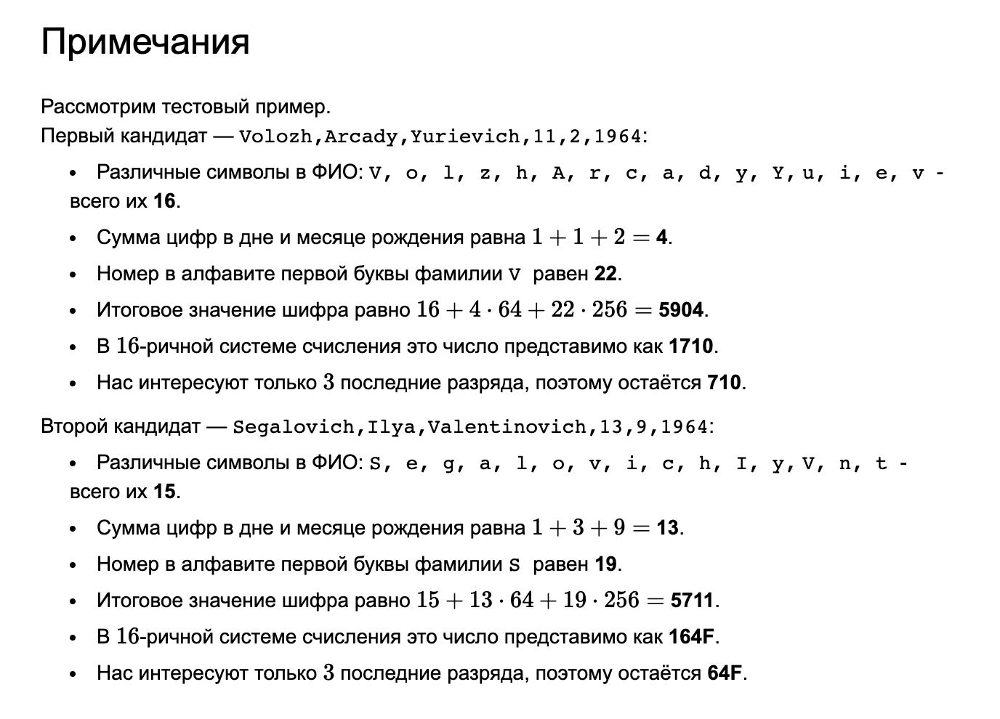
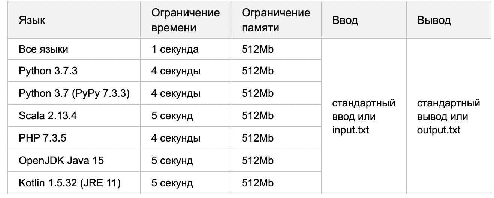
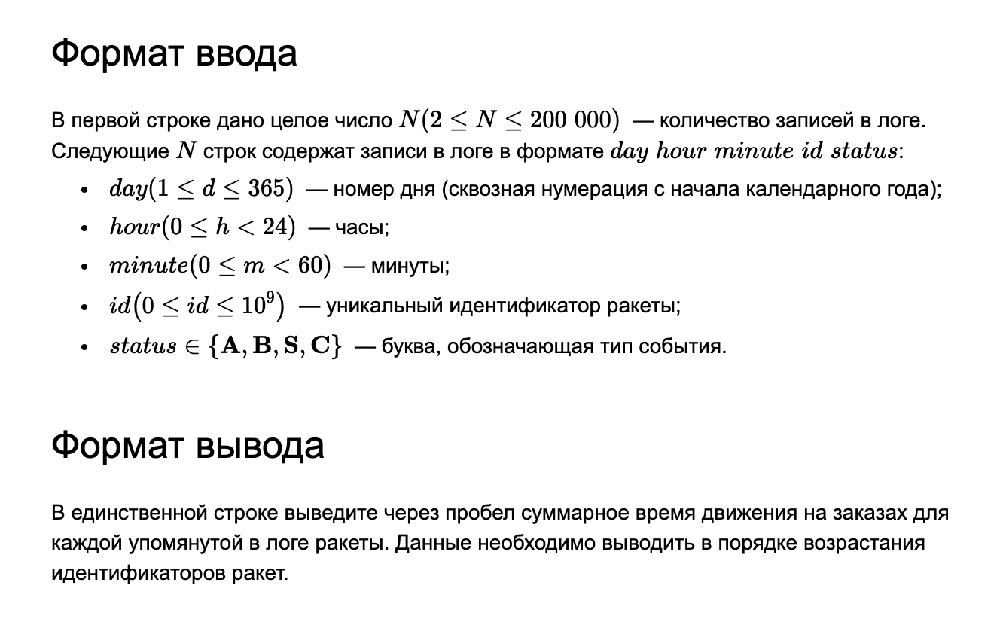
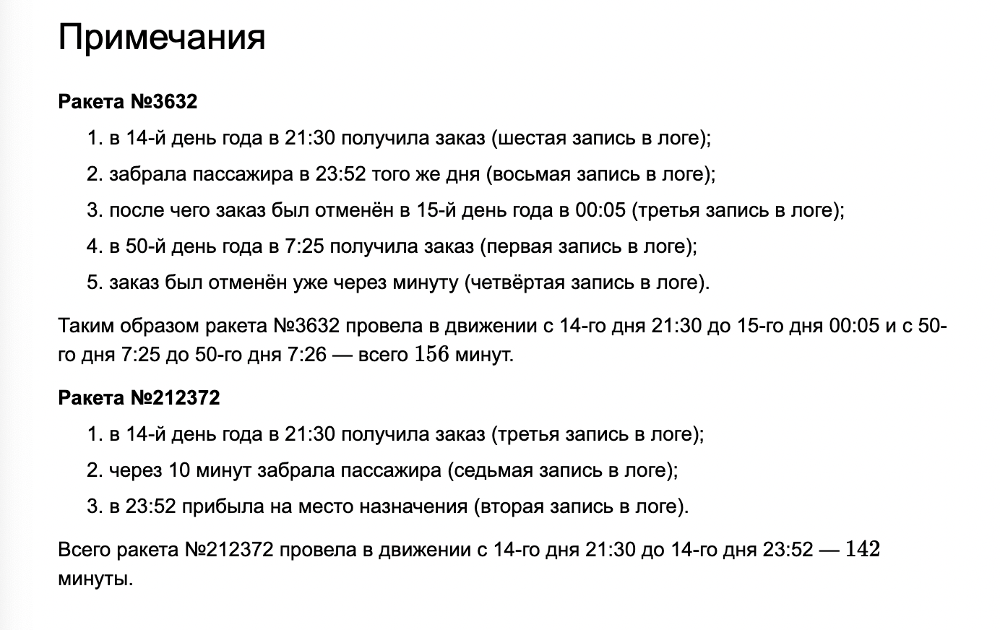

# Стажировка осень-зима 2022: бэкенд

### A. [Хитрый шифр](src/foxencript.cpp)

| Ограничение времени | 2 секунды                        |
|:-------------------:|:---------------------------------|
| Ограничение памяти  | 512Mb                            |
|        Ввод         | стандартный ввод или input.txt   |
|        Вывод        | стандартный вывод или output.txt |

Известная компания Тындекс в очередной раз проводит набор стажёров.
Заботясь о персональных данных соискателей, компания придумала хитрый алгоритм шифрования:

- Подсчитывается количество различных символов в ФИО (регистр важен, А и а — разные символы).
- Берётся сумма цифр в дне и месяце рождения, умноженная на 64.
- Для первой (по позиции в слове) буквы фамилии определяется её номер в алфавите (в 1 -индексации), умноженный на 256
  (регистр буквы не важен).
- Полученные числа суммируются.
- Результат переводится в 16-чную систему счисления (в верхнем регистре).
- У результата сохраняются только 3 младших разряда (если значимых разрядов меньше, то шифр дополняется до 3-х разрядов
  ведущими нулями).

#### Пример

|                                            ВВод                                            | Вывод     |
|:------------------------------------------------------------------------------------------:|:----------|
| 2  `Volozh,Arcady,Yurievich,11,2,1964`   `Segalovich,Ilya,Valentinovich,13,9,1964` | `710 64F` |

---

### B. Через тернии к клиенту

Известная компания Тындекс идёт в ногу со временем — с началом активных космических перелётов в компании открылся сервис
Тындекс.Ракетакси: пользователю необходимо лишь указать координаты начала и конца перелёта, после чего за ним вылетит
персональная ракета.
По сути любой заказ можно описать в виде событий четырёх типов:

1. A (accepted) - заказ принят в работу (ракета вылетела за клиентом);
2. B (boarding) - клиент сел в ракету;
3. S (success) - заказ успешно завершён (клиент вышел на планете назначения);
4. C (cancelled) - заказ отменён.
   Все происходящие с ракетами события отправляются на сервера, где сразу логируются. Вот только из-за проблем со
   связью (метеоритные потоки, вспышки на звездах и т.д.) отправка событий иногда затягивается, из-за чего записи в
   получившемся логе могут идти не по порядку.
   Гарантируется, что все описанные в логе события задают один из следующих сценариев:

  ---

1. A - B - S
2. A - B - C
3. A - C

Вам, как главному аналитику (и по совместительству главному программисту) ракетопарка, необходимо исследовать лог за
прошедший год и определить для каждой ракеты суммарное время движения (в минутах) в течение заказов.
В каждый момент времени ракета выполняет только один заказ. Будем считать, что каждая ракета в каждый момент времени:

- или стоит на месте в ожидании заказа,
- или перемещается по космосу, выполняя заказ.

Движение начинается после принятия заказа и завершается после отмены или завершения заказа. За одну минуту не может
произойти несколько событий, связанных с одной и той же ракетой.

#### Пример

|                                                                                               Ввод                                                                                               |   Вывод   |
|:------------------------------------------------------------------------------------------------------------------------------------------------------------------------------------------------:|:---------:|
| 8   `50 7 25 3632 A`   `14 23 52 212372 S`   `15 0 5 3632 C`  `14 21 30 212372 A`   `50 7 26 3632 C`   `14 21 30 3632 A`  `14 21 40 212372 B`  `14 23 52 3632 B` | `156 142` |

